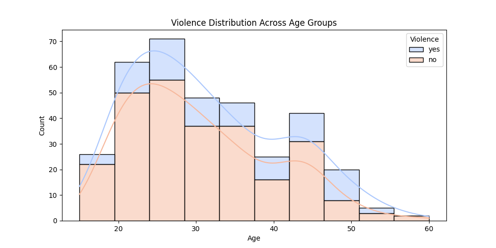

# Domestic Violence Prediction & Analysis

A data science project that combines machine learning and spreadsheet analysis to investigate and predict the likelihood of domestic violence based on demographic and socioeconomic factors.

## Features
- **Data Preprocessing**: String trimming, handling target variable encoding (Yes/No to 1/0).
- **Hybrid Analysis Approach**: 
  - **Python (Machine Learning)**: Feature engineering and predictive modeling.
  - **Excel (Statistical Analysis)**: Pivot tables and dynamic cross-tabulation.
- **Data Visualization**: Stacked distribution charts linking age cohorts with violence occurrence.

## Dataset Attributes
The analysis is performed on a public dataset sourced from **Kaggle**: [Domestic Violence Against Women Dataset](https://www.kaggle.com/datasets/fahmidachowdhury/domestic-violence-against-women). It contains the following core attributes:
- `Age`: Age of the individual.
- `Income` / `Employment` / `Education`: Socioeconomic status indicators.
- `Marital Status`: Marital state (Married / Unmarried).
- `Violence` / `Violence_Numeric`: The target indicator (Yes = 1, No = 0).

---

##  Data Visualization & Insights
Below is the stacked distribution chart generated through Excel PivotTables, highlighting how violence cases are distributed across different age cohorts:

